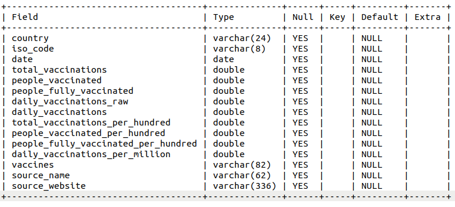
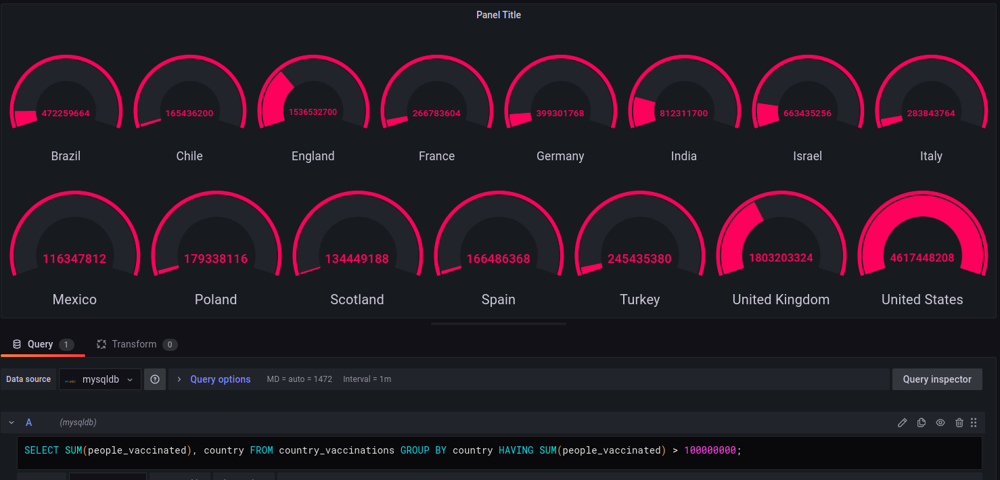
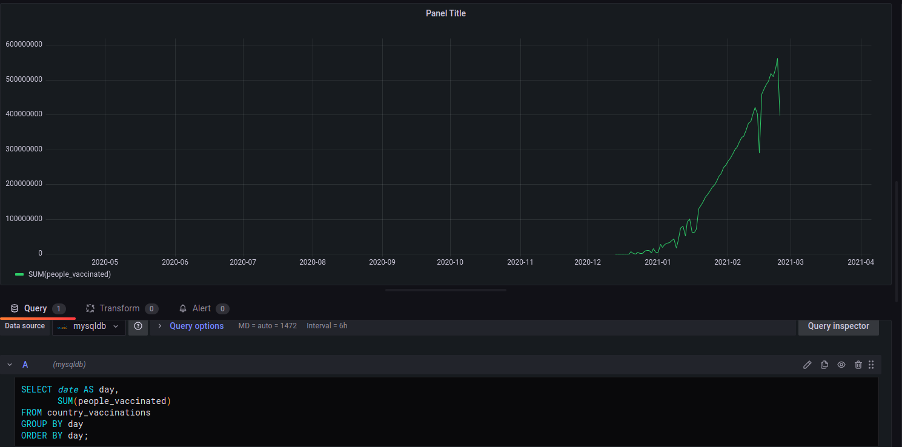

# **Un tableau de bord sur la covid**

> Afin de préparer une stack facilement déployable pour l'équipe de dev, les analystes data et le client, votre chef de projet vous demande de préparer des conteneurs pour des outils de Dataviz. Après discution avec la haute autorité de santé, votre client, les technologies retenues sont MySQL et GRAFANA. Le serveur est en Linux.

### **Sommaire**  

- manier les containers
- utilisation de docker-compose

# **Manier les containers**

## **Back-end**

### **Persistance**     

Trois volumes sont créés pour mysql :

- le volume mysql pour la persistance des bases de données,   
- le volume mysql_conf pour la sauvegarde des informations de connexion,
- le volume créé dans un dossier accessible de l'OS hôte ; la base de donnée téléchargée 'vaccination.sql' y est copiée.

Un volume est initié au montage de grafana. Le dossier sur la machine hôte doit être créé au préalable.

### **Réseau**    

Le réseau 'mysqlnet' est créé ; tous les containers l'utilisent pour communiquer. 

### **Base de données**   

un container mysql est amorcé pour sourcer le fichier vaccination.sql.

### **Code :**

Téléchargement des images nécessaires :
- docker pull grafana/grafana   
- docker pull mysql  
  
  
création du réseau :   
- docker network create mysqlnet
    
      
création des images hors run :
- docker volume create mysql
- docker volume create mysql_config 
    
   
création du dossier pour grafana (mode root)
- mkdir /var/lib/grafana -p
- chown -R 472:472 /var/lib/grafana
     
  
Amorçage du container mysql sous le nom mysqldb :
> docker run -d -v mysql:/var/lib/mysql \
  -v mysql_config:/etc/mysql -p 3306:3306 \
  -v /home/erwan/exercices/docker/grafana/fichiers:/home \
  --network mysqlnet \
  --name mysqldb \
  -e MYSQL_ROOT_PASSWORD=*** \
  mysql
     
      
Démarrage du container :
- docker start mysqldb
    
        
Import du fichier sql et lancement de l'invite de commande sql :
- docker exec -it mysqldb mysql -u root -p
- source /home/vaccination.sql
    
        
**Vérification :** 

> describe country_vaccinations;
 

Démarrage du Container Grafana :
- docker run -d -p 3000:3000 --network mysqlnet --name graf -v /var/lib/grafana:/var/lib/grafana -e "GF_SECURITY_ADMIN_PASSWORD=***" grafana/grafana

Le container est accessible à l'adresse localhost:3000 sur un navigateur web.

## **Front-end**

Sur l'interface graphique de grafana sur localhost:3000, il faut renseigner l'utilisateur ; ici le login est 'admin', le mot de passe est à définir dans le run de containers.  

L'interface propose une connexion à une base de données mysql ; les données suivantes sont renseignées :
- host : mysqldb:3306
- database : vaccinations

La connexion étant opérationnelle, deux graphiques sont créés à partir de deux interfaces 'panels' de grafana, tel que demandé, à partir de requêtes sql.

### **Pays dans lesquels il y a plus de 100.000.000 de personnes vaccinées :**  

### **Evolution de la vaccination sous forme de série temporelle :** 

# **Docker-compose**

un premier apprentissage ayant été réalisé sous docker, un fichier docker-compose en yaml est édité afin de simplifier l'éxécution de l'ensemble.

Les volumes mysql et mysql_config sont repris. Le troisième volume de mysql n'est pas repris, en effet la base de données est déja importée dans le volume mysql dans la première partie.   
Le volume créé pour grafana ne fonctionne pas, en effet une vérification regex de docker-compose n'autorise que chiffres, lettres et les deux tirets. Un volume grafana est donc créé.  

L'interface de mysql garde donc se persistance ; pour grafana, il suffit de refaire la connexion à la base de données, ainsi que les deux requêtes. La persistance fonctionne.

## **Conclusion**  

Cette première approche sans docker compose est intéressante, afin de bien évaluer ce qui fonctionne, ce qui ne fonctionne pas, pour les run des containers.
Cela aide aussi à mémoriser les options, s'habituer à l'architecture des containers et de l'architecture de la machine hôte.  

La deuxième approche avec docker-compose est alors plus évidente à appréhender.  

Grafana semble intéressant en interface front-end afin d'avoir des graphiques facilement modulables en première approche, avec uniquement des requêtes sql, en container, et sans beaucoup de lignes de code.

Néanmoins, pour de l'analyse, le langage python, associé à sql, permet de manipuler plus facilement des données, même si l'affichage python des données demande plus de code que l'utilisation de grafana.